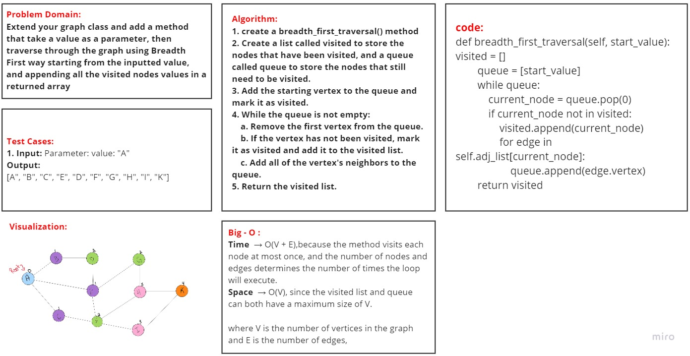

# Code Challenge: Graphs 
## Challenge Summary
Breadth First:

Extend your graph class and add a method that take a value as a parameter, then traverse through the graph using Breadth First way starting from the inputted value, and appending all the visited nodes values in a returned array

### [Pull Requests](https://github.com/IsmailAlamir/Code-Challenges-and-Algorithms/pull/14)

## whiteboard
