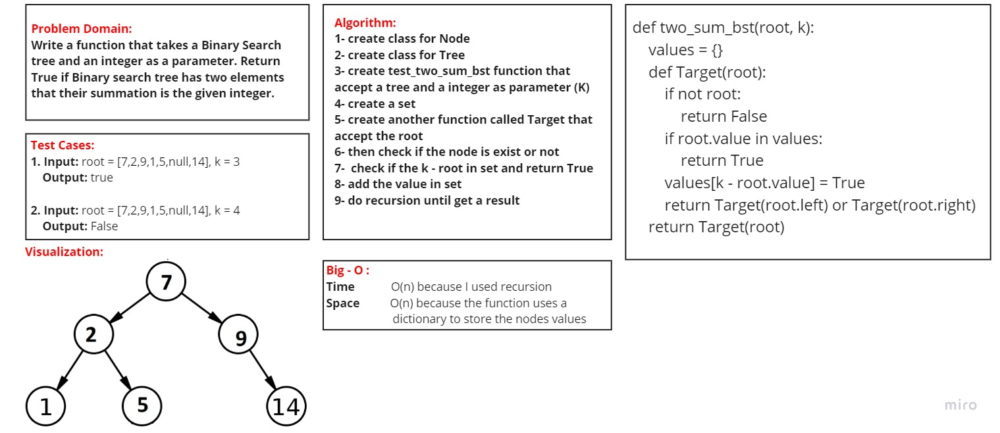

# Code Challenge: Convert Sorted Array to BST
## Challenge Summary
Write a function that takes a Binary Search tree and an integer as a parameter. Return True if Binary search tree has two elements that their summation is the given integer.

### [Pull Requests](https://github.com/IsmailAlamir/Code-Challenges-and-Algorithms/pull/13)

## whiteboard

