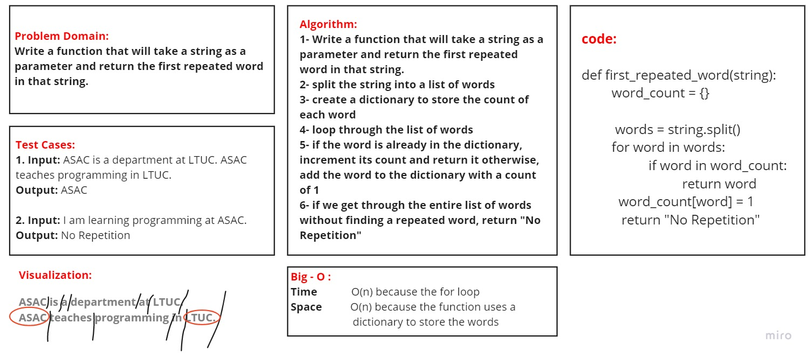

# Code Challenge: Convert Sorted Array to BST
## Challenge Summary
Write a function that will take a string as a parameter and return the first repeated word in that string.

### [Pull Requests](https://github.com/IsmailAlamir/Code-Challenges-and-Algorithms/pull/13)

## whiteboard
