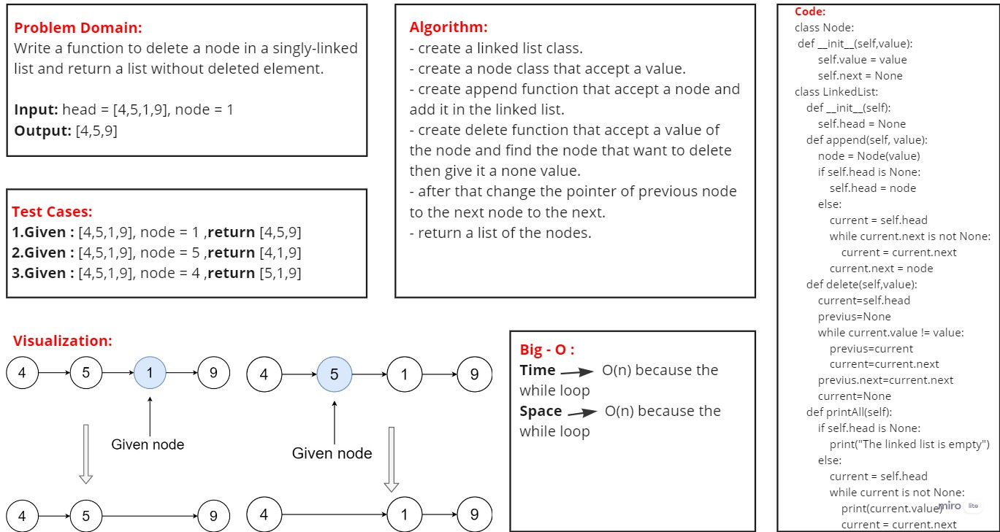

# Code Challenge: Linked List
## Challenge Summary

- Write a function to delete a node in a singly-linked list
- return a list without deleted element

### difficulties I have had with the assignment:
I faced some in the "pytest".
