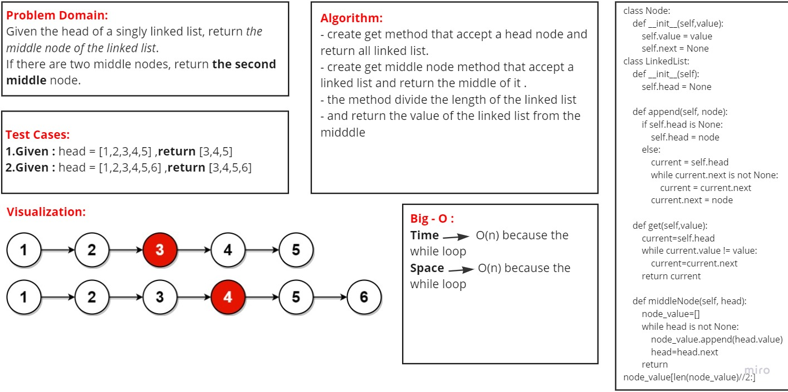

# Code Challenge: Linked List
## Challenge Summary
- Given the head of a singly linked list, return the middle node of the linked list.
- If there are two middle nodes, return the second middle node.

### [Pull Requests](https://github.com/IsmailAlamir/Code-Challenges-and-Algorithms/pull/4)

## whiteboard

