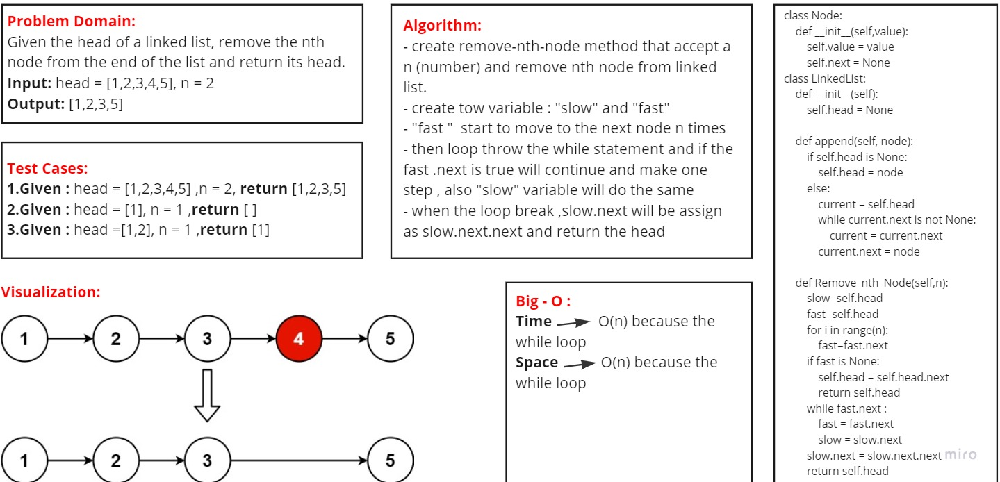

# Code Challenge: Linked List
## Challenge Summary
Given the head of a linked list, remove the nth node from the end of the list and return its head.

### [Pull Requests](https://github.com/IsmailAlamir/Code-Challenges-and-Algorithms/pull/5)

## whiteboard

