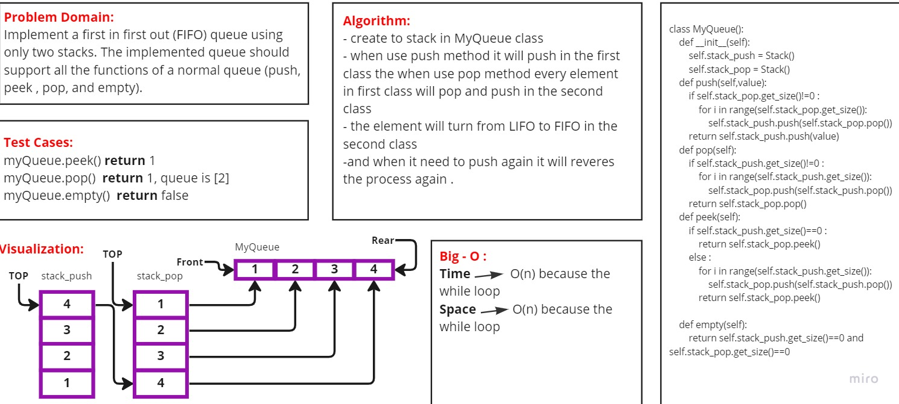

# Code Challenge: Stack and Queue
## Challenge Summary

Implement a first in first out (FIFO) queue using only two stacks. The implemented queue should support all the functions of a normal queue (push, peek , pop, and empty).

Implement the MyQueue class:

- **push(int x)** Pushes element x to the back of the queue.
- **pop()** Removes the element from the front of the queue and returns it.
- **peek()** Returns the element at the front of the queue.
- **empty()** Returns true if the queue is empty, false otherwise.

### [Pull Requests](https://github.com/IsmailAlamir/Code-Challenges-and-Algorithms/pull/7)
##whiteboard

### difficulties I have had with the assignment:
nothing
