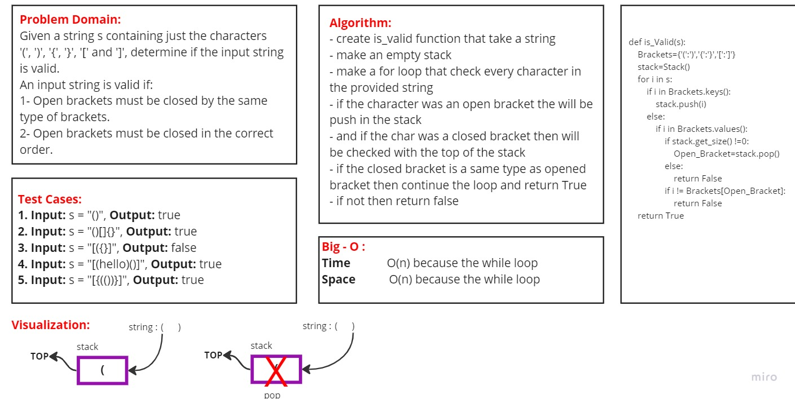

# Code Challenge: Stack and Queue
## Challenge Summary
Valid Parentheses:

Given a string s containing just the characters '(', ')', '{', '}', '[' and ']', determine if the input string is valid.

An input string is valid if:

- Open brackets must be closed by the same type of brackets.
- Open brackets must be closed in the correct order.

### [Pull Requests](https://github.com/IsmailAlamir/Code-Challenges-and-Algorithms/pull/8)
## whiteboard

### difficulties I have had with the assignment:
nothing