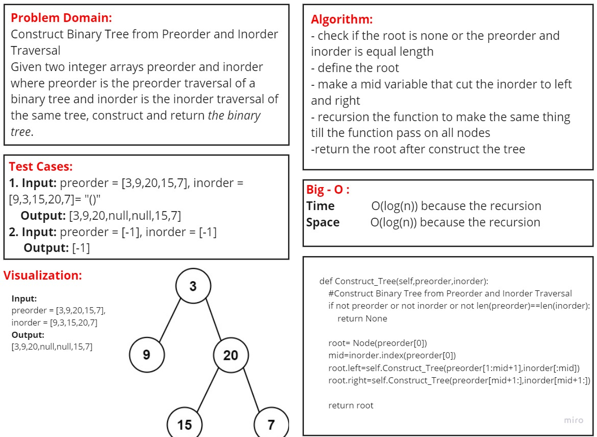

# Code Challenge: Construct BT from Preorder & Inorder
## Challenge Summary
Given two integer arrays preorder and inorder where preorder is the preorder traversal of a binary tree and inorder is the inorder traversal of the same tree, construct and return the binary tree.

### [Pull Requests]()

## whiteboard
