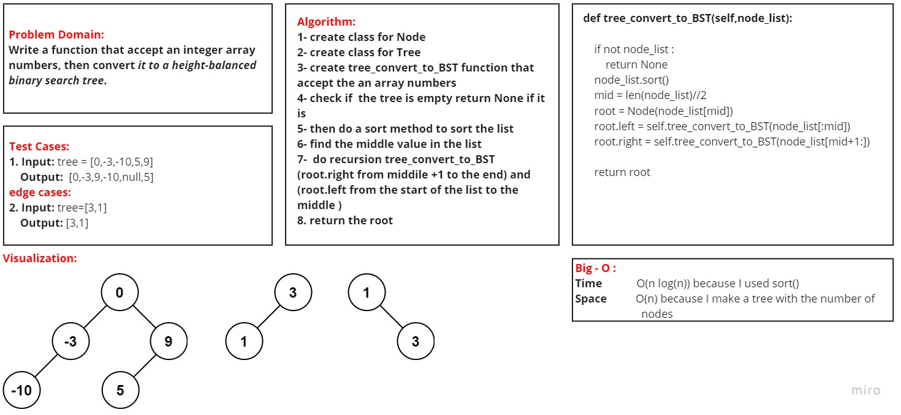

# Code Challenge: Convert Sorted Array to BST
## Challenge Summary
Given an integer array nums, convert it to a height-balanced binary search tree.

A height-balanced binary tree is a binary tree in which the depth of the two subtrees of every node never differs by more than one.

### [Pull Requests](https://github.com/IsmailAlamir/Code-Challenges-and-Algorithms/pull/10)

## whiteboard
